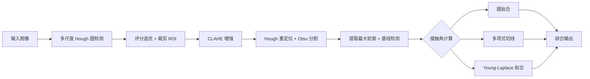
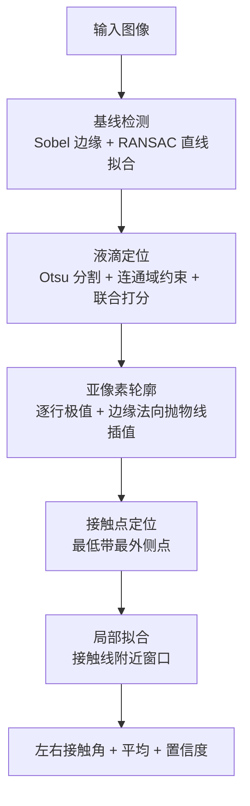

<div align="center">

# AngleAP 💧

**基于图像的接触角（Contact Angle）自动测量工具集**

一套面向固着液滴（sessile drop）的接触角测量算法实现，包含 **CUPET** 与 **CSIEC** 两套独立管线，仅供教学研究使用。

[](https://www.python.org/)
[](https://opencv.org/)
[](https://scipy.org/)
[](https://www.mathworks.com/)
[](#许可与联系)

</div>

---

## 目录

- [项目简介](#项目简介)
- [背景知识：接触角与 Young–Laplace 方程](#背景知识接触角与-younglaplace-方程)
- [CUPET —— 接触角测量算法集](#cupet--接触角测量算法集)
  - [算法一：圆拟合法（球冠近似）](#算法一圆拟合法球冠近似)
  - [算法二：多项式切线法](#算法二多项式切线法)
  - [算法三：Young–Laplace 拟合法（ADSA）](#算法三younglaplace-拟合法adsa)
  - [配套图像处理流程](#配套图像处理流程)
  - [版本演进](#cupet-版本演进)
- [CSIEC —— 基于 OpenDrop 的接触角测量](#csiec--基于-opendrop-的接触角测量)
  - [算法流程](#csiec-算法流程)
  - [拟合方法](#csiec-拟合方法)
  - [接触角符号约定](#接触角符号约定)
  - [与 OpenDrop 的差异](#与-opendrop-的差异)
  - [版本演进](#csiec-版本演进)
- [APP for educational](#app-for-educational)
- [快速开始](#快速开始)
- [参考文献](#参考文献)
- [许可与联系](#许可与联系)

---

## 项目简介

**AngleAP**（Angle from Pictures）从单张液滴图像出发，自动定位液滴、检测固-液界面（基线）、提取轮廓，并用几何或物理模型计算接触角。仓库按两条技术路线组织：

| 子项目 | 路线 | 核心方法 | 状态 |
|---|---|---|---|
| **CUPET** | 自研算法集 | 圆拟合 / 多项式切线 / Young–Laplace 拟合 | ✅ 已完成（多版本迭代） |
| **CSIEC** | 参考 [OpenDrop](https://github.com/jdber1/opendrop) 算法思想 | 局部几何拟合（圆 / 椭圆 / 多项式 / 直线） | ✅ 已完成（含独立重实现 `cadrop`） |
| **APP for educational** | 将上述 Python 代码移植为 Android 可用的形态 | — | 🚧 进行中 |

> 整个仓库仅用于**教学用途**。如欲使用代码，请先联系作者（见[文末](#许可与联系)）。

### 目录结构

```
AngleAP/
├── CUPET(already done)/            # 自研接触角测量算法集（版本迭代）
│   ├── v0(not usable)/             #   早期理论与 AI 生成代码（弃用）
│   ├── v1.0 Round(matlab)/         #   MATLAB 圆拟合（三点定圆）
│   ├── v1.3.alpha Enhancer/        #   图像增强尝试
│   ├── v1.7.alpha using SAM/       #   SAM 分割 + Young–Laplace（双参数）
│   ├── v2.2 Two contact points/    #   双接触点 + 多项式切线
│   ├── v3.7 Angle-AssistantAP/     #   Flask 网页版（单参数 Y–L）
│   ├── v4.4.alpha ALL in one/      #   全自动一体化管线（Y–L + 圆 + 多项式）
│   └── index_v4.4.html             #   浏览器端 OpenCV.js 原型
├── CSIEC/                          # 基于 OpenDrop 算法思想的接触角测量
│   ├── Summer Vacation ver2.9/     #   Y–L 全局拟合 + 局部多项式
│   ├── Summer Vacation ver,alpha 3.5 Data/   # 数据集（176 张液滴图片）
│   ├── Summer vacation ver 4.6 (available)/   # OpenDrop 算法移植 + 批量 + 可视化
│   └── Summer vacation ver 5.3 (available)/   # cadrop 独立重实现（clean-room）
└── APP for educational/            # Android 移植
```

---

## 背景知识：接触角与 Young–Laplace 方程

**接触角（contact angle）θ** 是固-液-气三相接触线上，液滴界面切线与固体表面（沿液相一侧）之间的夹角。它是表征材料表面润湿性的核心量：

- $θ < 90°$：**亲水**（hydrophilic）
- $θ > 90°$：**疏水**（hydrophobic）
- $θ \gtrsim 150°$：**超疏水**（superhydrophobic）

液滴的平衡形状由**杨-拉普拉斯（Young–Laplace）方程**决定：界面两侧的压力差与表面张力成正比、与界面平均曲率成正比，

$$\Delta P = \gamma\left(\frac{1}{R_1}+\frac{1}{R_2}\right) = \gamma(\kappa_1+\kappa_2).$$

对于轴对称的液滴，用弧长 $s$ 与切线与水平面的夹角 $\varphi$ 参数化轮廓，可得（轴对称液滴形貌分析 / ADSA 的标准形式）：

$$
\frac{\mathrm{d}\varphi}{\mathrm{d}s} = \frac{2}{R_0} + \beta z - \frac{\sin\varphi}{x},
\qquad
\frac{\mathrm{d}x}{\mathrm{d}s} = \cos\varphi,
\qquad
\frac{\mathrm{d}z}{\mathrm{d}s} = \sin\varphi.
$$

其中 $R_0$ 为顶点曲率半径，$\beta=\Delta\rho g/\gamma$ 为毛细常数（无量纲形状参数，等价于 Bond 数 $\mathrm{Bo}=\beta R_0^2$），$x$ 为径向坐标，$z$ 为轴向坐标（自顶点沿液滴内部方向）。

接触角即为轮廓在接触线处的切线角：**$\theta = \varphi\big|_{z=0}$**。

- 当重力可忽略（液滴足够小、或 $\mathrm{Bo}\ll1$）时，$\beta\to0$，方程退化为**球冠**（spherical cap），轮廓是一个圆弧——这正是"圆拟合法"的物理依据。
- 当重力不可忽略时，必须保留 $\beta z$ 项，直接对 ODE 做数值拟合——这正是"Young–Laplace 拟合法"（ADSA）的物理依据。

---

## CUPET —— 接触角测量算法集

CUPET 是一套自研的接触角测量实现，围绕**三种基础算法**逐步演进，并辅以完整的图像预处理流程。三种算法由粗到精、由几何近似到物理模型，分别对应不同的精度与适用场景。

### 算法一：圆拟合法（球冠近似）

**物理假设**：液滴为理想球冠（忽略重力形变，$\mathrm{Bo}\ll1$）。

**做法**：对液滴轮廓做最小二乘圆拟合，得到圆心 $(x_c, z_c)$ 与半径 $R$，再由几何关系求接触角：

$$\theta = 90° - \arcsin\!\left(\frac{z_c - z_0}{R}\right)$$

其中 $z_0$ 为基线（接触线）处的轴向坐标。

**实现细节**（对应 `v1.0 Round.m` 与 `v4.4` 的 `calc_circle`）：

- 线性化圆方程 $x^2 + z^2 = 2x_c\,x + 2z_c\,z + C$，用最小二乘解出圆心与半径；
- `v1.0` 为 MATLAB 手动三点定圆；`v4.4` 为自动全轮廓拟合，并对 $\theta$ 做 `arccos((z_0-z_c)/R)` 的等价形式，兼顾完全润湿（$\theta\to0$）与完全不润湿（$\theta\to180°$）的极限。

> 优点：简单、稳定；缺点：对大液滴（重力压扁）系统性偏小。

### 算法二：多项式切线法

**做法**：不假设整体形状，只在接触点附近的局部窗口内用二次（或三次）多项式拟合轮廓，取接触点处的一阶导作为切线，得到接触角。

**实现细节**（对应 `v2.2` 与 `v4.4` 的 `calc_poly`）：

- 拟合 $r = a z^2 + b z + c$（或 $x = a y^2 + b y + c$），接触角由 $\theta = \arctan\big(\mathrm{d}r/\mathrm{d}z\big|_{z=0}\big)$ 给出；
- `v2.2` 由用户点击左右两个接触点后自动提取边缘并拟合；`v4.4` 全自动取左右最外侧点附近的局部窗口。

> 优点：对局部形状刻画准确、鲁棒；缺点：窗口大小与多项式阶数需要合理选择，物理依据弱于 Y–L。

### 算法三：Young–Laplace 拟合法（ADSA）

**做法**：直接数值积分轴对称 Young–Laplace ODE，将形状参数拟合到实测轮廓，再读取接触线处的切线角 $\varphi$。

**两个变体**（对应不同版本）：

| 变体 | 待拟合参数 | ODE（$x>0$ 时） | 适用版本 |
|---|---|---|---|
| 单参数（球冠极限） | 顶点曲率 $R_0$ | $\dfrac{\mathrm{d}\varphi}{\mathrm{d}s} = \dfrac{2}{R_0} - \dfrac{\sin\varphi}{x}$ | `v3.7`、`v4.4` |
| 双参数（完整重力项） | 顶点曲率 $R_0$、毛细常数 $\beta$ | $\dfrac{\mathrm{d}\varphi}{\mathrm{d}s} = \dfrac{2}{R_0} - \beta z - \dfrac{\sin\varphi}{x}$ | `v1.7` |

**实现细节**：

1. 用 `scipy.integrate.solve_ivp`（RK45，含事件检测）从顶点附近初值积分 ODE；
2. 用 `scipy.optimize.least_squares` 最小化"理论轮廓 $z$ 与实测轮廓 $z$ 之差"；
3. 接触角 = 积分到接触线处时 $\varphi$ 的角度值。

> 优点：物理最严谨，可同时估计表面张力相关参数；缺点：对轮廓噪声与初值敏感，点不足时需回退。



### 配套图像处理流程

- **图像增强**：LAB 色彩空间 CLAHE 局部对比度增强 + 双边滤波去噪 + Unsharp Masking 锐化；
- **液滴定位**：多尺度 Hough 圆检测，按"边缘强度 + 内外对比度 + 内部均匀性 + 尺寸"评分选优；
- **液滴分割**：基线下方涂黑 → Otsu 阈值 → 形态学闭/开运算 → 取最大连通域；
- **基线（接触线）检测**：轮廓宽度坍缩启发式，或 Sobel 梯度 + RANSAC 直线拟合；
- **深度学习分割**（`v1.7` 可选）：用 SAM（Segment Anything Model, ViT-H）自动分割液滴，基底仍用传统 CV 检测。

### CUPET 版本演进

| 版本 | 名称 | 算法要点 |
|---|---|---|
| v0 | Theory | 早期理论与 AI 生成代码（弃用） |
| v1.0 | Round (matlab) | MATLAB 手动三点定圆（球冠近似） |
| v1.3 | Enhancer | 图像增强探索 |
| v1.7 | using SAM | SAM 分割 + 双参数 Young–Laplace |
| v2.2 | Two contact points | 手动双接触点 + 多项式切线 |
| v3.7 | Angle-AssistantAP | Flask 网页版，单参数 Y–L |
| v4.4 | ALL in one | 全自动管线，Y–L + 圆 + 多项式三重校验 |

---

## CSIEC —— 基于 OpenDrop 的接触角测量

CSIEC 以 [OpenDrop](https://github.com/jdber1/opendrop)（Berry et al., 2015；Huang et al., 2021）发表的接触角测量算法为蓝本，实现自动基线检测、液滴分割、亚像素轮廓提取与局部拟合。最终版 `v5.3` 是一个**不包含任何 OpenDrop 源码**的独立重实现（clean-room，模块 `cadrop`），并针对正光（front-lit）图像做了若干实质改进。

### CSIEC 算法流程



**各步骤说明：**

1. **基线检测**：逐列 Sobel 找最强的"暗→亮"水平台阶，对候选边缘点做 RANSAC 拟合成近水平直线；并联合尝试"液滴在上"与"液滴在下"（悬挂/倒置液滴）两种取向，选得分最高者——这使程序能同时处理正立与倒置液滴。

2. **液滴分割**：在基线定义的"液滴一侧"区域内做 Otsu 阈值分割，再用连通域约束（必须落在台面上、不贴图框、宽度合理、质心在液滴一侧）筛选真实液滴，剔除台面棱线与反光。

3. **亚像素轮廓**：逐行取掩码的左右极值点，再沿边缘法向用抛物线插值细化到亚像素；并用梯度阈值剔除"台面平切处"的假边缘。

4. **接触点定位**：取最低一带中**最外侧**的点作为接触点（而非简单取 $z$ 最小点——掩码在台面上被平切，直接用 $z$ 最小会误选液滴内部）。

5. **局部拟合**：每侧只取接触点附近 `win_frac × 底宽`（默认 0.25，与 OpenDrop 的窗口思想一致）的点做拟合，避免重力压扁的整体轮廓污染局部接触角。

### CSIEC 拟合方法

| 方法 | 模型 | 拟合算法 | 说明 |
|---|---|---|---|
| `circle` | 圆 | Kasa 代数初值 + 几何距离 Gauss–Newton 精修 | 解析求 $z=0$ 处切线角 |
| `ellipse` | 椭圆（一般二次曲线） | Halir–Flusser 直接椭圆拟合 | 更贴合非圆轮廓 |
| `poly` | 二次多项式 $r=f(z)$ | 最小二乘多项式 | 用 $f'(0)$ 求切线 |
| `line` | 直线 $r=mz+c$ | 总体最小二乘 | 楔形轮廓 |
| `auto` | 自适应 | 先试直线，残差大则用圆 | 默认 |

### 接触角符号约定

这是 CSIEC 保证**疏水液滴（$θ>90°$）可被正确表示**的关键。定义基线为 $z=0$，$z$ 恒指向液滴内部；令轮廓切线向上为 $(t_r, t_z)$，则：

$$
\theta_{\mathrm{left}}  = \operatorname{atan2}(t_z,\;\,t_r),
\qquad
\theta_{\mathrm{right}} = \operatorname{atan2}(t_z, -t_r).
$$

两侧都落在 $(0°, 180°)$，**全程无取绝对值**。旧版 `core_old_backup.py` 中的 `abs(t[0])` 会强行把角度压缩到 $\le90°$，正是导致角度"89.3° 封顶"的 bug。

### 与 OpenDrop 的差异

`cadrop` 在数学上与 OpenDrop 等价，但有三处有意的偏离（均针对正光图像上台面亮于液滴的情形）：

1. **自动基线检测**——OpenDrop 需要用户手动拖一条基线，`cadrop` 全自动；
2. **亚像素轮廓细化**——OpenDrop 保留整数像素坐标，`cadrop` 沿边缘法向插值到亚像素；
3. **联合的"基线 + 液滴"搜索**——同时处理正立与倒置液滴，并对多条候选台面边缘打分择优。

### CSIEC 版本演进

| 版本 | 名称 | 算法要点 |
|---|---|---|
| v2.9 | New2 | Y–L 全局拟合 + 局部多项式，双方法并行 |
| v3.5 | Data | 数据集（176 张液滴图片） |
| v4.6 | available | OpenDrop 算法移植（`extract_contact_angle_features` + `contact_angle_fit`）+ 批量 + Excel 导出 + 可视化 |
| v5.3 | available | `cadrop` 独立重实现（clean-room），圆/椭圆/多项式/直线 + `auto`，Flask + 批量 |

> 精度自评（见 `cadrop` 内部测试）：基线与 OpenDrop 手动红线的中位偏差约 **0.3 px**；在同一批 176 张图上，`auto` 方法的失败率从旧版的约 31% 降至 **≈1%**。

---

## APP for educational

将 CUPET / CSIEC 的 Python 代码与依赖资源转换为 Android 可用的形态。当前仍在进行中，详见 [`APP for educational/`](APP%20for%20educational)。

---

## 快速开始

各子项目依赖略有差异，通用依赖为 `numpy opencv-python scipy`（CSIEC `v5.3` 另需 `flask`）。

```bash
# CUPET v4.4 —— 全自动一体化管线
cd "CUPET(already done)/v4.4.alpha ALL in one"
python contact_angle_auto.py drop_image.jpg -o result.jpg

# CSIEC v5.3 —— 网页界面
cd "CSIEC/Summer vacation ver 5.3 (available)"
python app.py                        # 打开 http://127.0.0.1:5000

# CSIEC v5.3 —— 批量测量 + CSV
python batch.py --dir "path/to/images" --method auto --out results.csv

# CSIEC v5.3 —— 拟合数学单元测试
python tests/test_fitting.py
```

> CUPET `v1.7` 需要额外的 SAM 权重 `sam_vit_h_4b8939.pth`（参见 [segment-anything](https://github.com/facebookresearch/segment-anything)）。

---

## 参考文献

1. Berry, J. D., Neeson, M. J., Dagastine, R. R., Chan, D. Y. C., & Tabor, R. F. (2015). *Measurement of surface and interfacial tension using pendant drop tensiometry.* **Journal of Colloid and Interface Science**, 454, 226–237.
2. Huang, E., Skoufis, A., Denning, T., Qi, J., Dagastine, R. R., Tabor, R. F., & Berry, J. D. (2021). *OpenDrop: Open-source software for pendant drop tensiometry & contact angle measurements.* **Journal of Open Source Software**, 6(58), 2604.
3. OpenDrop source repository: <https://github.com/jdber1/opendrop>
4. Kirillov, A. et al. *Segment Anything.* <https://github.com/facebookresearch/segment-anything>

---

## 许可与联系

本项目为 **AngleAP**，作者 [8cheh](https://github.com/8cheh)。

- **仅供教学使用**，未附带开源许可证；
- 如欲使用代码，请先联系：**huangbache@gmail.com**。

> CSIEC 的 `cadrop` 是对 OpenDrop（GPL-3.0）所发表数学原理的独立重实现，**不包含任何 OpenDrop 源码**；如将本项目代码用于分发，请自行评估与 OpenDrop 许可证的兼容性。
